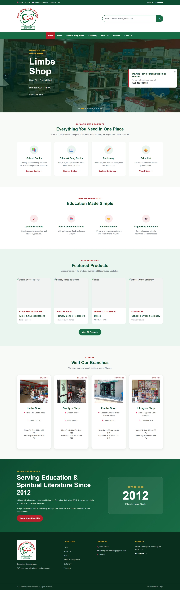

# NKHUNGUDZU BOOKSHOP



A modern online bookshop dedicated to selling school and religious books [live priview](https://nkhungudzu-bookshop-git-main-uuu-f21f.vercel.app/).

## 📚 About

NKHUNGUDZU Bookshop is a web-based platform designed to provide easy access to educational and religious literature. Our mission is to make quality books accessible and affordable for students, educators, and readers seeking spiritual and academic resources.

## ✨ Features

- **Browse Catalog** - Explore our collection of school and religious books
- **Responsive Design** - Seamless experience across desktop, tablet, and mobile devices
- **User-Friendly Interface** - Intuitive navigation and search functionality
- **Product Management** - View detailed book descriptions and availability

## 🛠️ Technology Stack

- **Frontend**: HTML, JavaScript, CSS
  - HTML (41.9%) - Structure and markup
  - JavaScript (35.4%) - Interactivity and functionality
  - CSS (22.7%) - Styling and layout

## 📁 Project Structure

```
NKHUNGUDZU_BOOKSHOP/
├── index.html          # Main landing page
├── css/                # Stylesheets
├── js/                 # JavaScript files
├── images/             # Image assets
├── pages/              # Additional pages
└── README.md          # This file
```

## 🚀 Getting Started

### Prerequisites

- A modern web browser (Chrome, Firefox, Safari, Edge)
- No installation required - runs directly in your browser

### Installation

1. Clone the repository:
```bash
git clone https://github.com/ekari20/NKHUNGUDZU_BOOKSHOP.git
```

2. Navigate to the project directory:
```bash
cd NKHUNGUDZU_BOOKSHOP
```

3. Open `index.html` in your web browser or serve with a local server:
```bash
# Using Python 3
python -m http.server 8000

# Using Node.js (if http-server is installed)
http-server
```

4. Visit `http://localhost:8000` in your browser

## 📖 Usage

- Browse available books by category
- View book details including price and description
- Add books to your selection
- Proceed through the checkout process

## 🤝 Contributing

Contributions are welcome! Please feel free to submit pull requests or open issues to improve the bookshop.

## 📝 License

This project is open source and available under the MIT License.

## 📧 Contact

For inquiries about books or the bookshop, please reach out through GitHub or check the contact information in the website.

---

**Happy reading! 📚**
