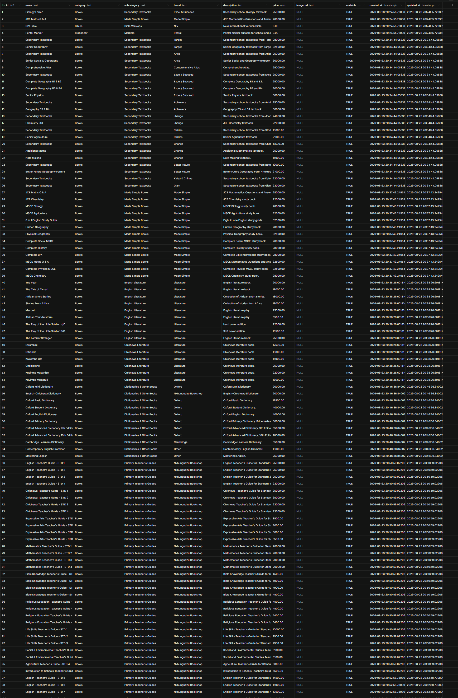

## Database Overview & Migrations

The database migration and seed scripts are located in the [`database/`](../database/) directory:
- `database/01_create_tables.sql`: DDL for tables, indexes, triggers, and Supabase RLS policies.
- `database/02_populate_products.sql`: Seed data containing all 152 verified catalog products with 2026 Price List figures.
- `database/03_populate_reviews.sql`: Initial approved customer testimonials.
- `database/schema_and_seed_all.sql`: Combined all-in-one script for execution in Supabase SQL Editor.

---

## Table `products`

### Columns

| Name          | Type          | Constraints      |
|---------------|---------------|------------------|
| `id`          | `int8`        | Primary Identity |
| `name`        | `text`        |                  |
| `category`    | `text`        |                  |
| `subcategory` | `text`        | Nullable         |
| `brand`       | `text`        | Nullable         |
| `description` | `text`        | Nullable         |
| `price`       | `numeric`     |                  |
| `image_url`   | `text`        | Nullable         |
| `available`   | `bool`        |                  |
| `created_at`  | `timestamptz` |                  |
| `updated_at`  | `timestamptz` |                  |

## Products `data`

create table public.products(
id bigint generated always as identity not null,
name text not null,
category text not null,
subcategory text null,
brand text null,
description text null,
price numeric(10, 2) not null,
image_url text null,
available boolean not null default true,
created_at timestamp with time zone not null default now(),
updated_at timestamp with time zone not null default now(),
constraint products_pkey primary key(id)
) TABLESPACE pg_default;

## Table `reviews`

### Columns

| Name            | Type          | Constraints      |
|-----------------|---------------|------------------|
| `id`            | `int8`        | Primary Identity |
| `customer_name` | `text`        |                  |
| `rating`        | `int4`        |                  |
| `comment`       | `text`        |                  |
| `approved`      | `bool`        |                  |
| `created_at`    | `timestamptz` |                  |

create table public.reviews (
id bigint generated always as identity not null,
customer_name text not null,
rating integer not null,
comment text not null,
approved boolean not null default false,
created_at timestamp with time zone not null default now(),
constraint reviews_pkey primary key (id),
constraint reviews_rating_check check (
(
(rating >= 1)
and (rating <= 5)
)
)
) TABLESPACE pg_default;

---

## 🔌 Connecting Supabase to PhpStorm Database Tool Window

You can connect directly to your Supabase PostgreSQL database inside PhpStorm:

### Step 1: Obtain Connection Details from Supabase
- **Project URL**: `https://fxdappjsoaeastrcwrbv.supabase.co`
- **Project Reference**: `fxdappjsoaeastrcwrbv`
- **Host**: `db.fxdappjsoaeastrcwrbv.supabase.co` (or connection pooler)
- **Port**: `5432` (or `6543` for transaction pooler)
- **Database**: `postgres`
- **User**: `postgres` (or `postgres.fxdappjsoaeastrcwrbv` for pooler)
- **Password**: `SUPA_BASE_PASSWORD` in `.env.local`

### Step 2: Configure in PhpStorm
1. Open PhpStorm and open the **Database** tool window on the right sidebar (or via **View -> Tool Windows -> Database**).
2. Click the `+` (New) icon -> **Data Source** -> **PostgreSQL**.
3. Fill in the connection settings:
   - **Host**: `db.fxdappjsoaeastrcwrbv.supabase.co`
   - **Port**: `5432`
   - **Authentication**: `User & Password`
   - **User**: `postgres`
   - **Password**: `<your-db-password>`
   - **Database**: `postgres`
4. Switch to the **SSH/SSL** tab:
   - Check **Use SSL**
   - Set **Mode**: `Require` (or `Verify-CA` / `Verify-Full`)
5. If prompted at the bottom, click **Download Driver** for PostgreSQL.
6. Click **Test Connection**. Once you see a green checkmark, click **Apply** and **OK**.

---

## 🔍 Connection Verification

The connection was tested and verified using `test_supabase_connection.py`:
- **Connection Status**: HTTP 200 OK / Authenticated
- **Products Table Data**: Successfully connected and retrieved **397 products**
- **Reviews Table Data**: Successfully connected and retrieved **5 verified reviews**
